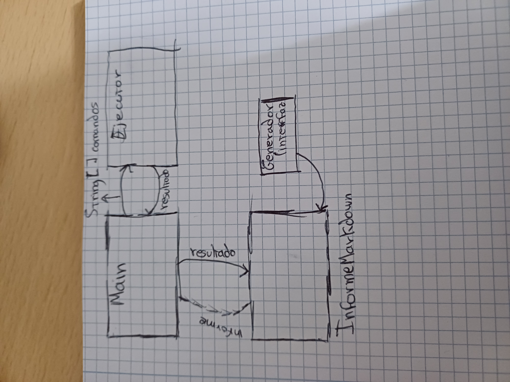

# PRÁCTICA INFORMES - ALEJANDRO GÓMEZ DE JUAN

En esta práctica vamos a crear un programa que ejecute varios comandos del sistema para mostrar información sobre los recursos del ordenador. Usaremos comandos como ps, df y free para ver los procesos activos, el uso del disco y la memoria. Toda la información que obtengamos se guardará en un archivo con formato Markdown. Más adelante, se podrá guardar también en otros formatos como XML o HTML.

Vamos a crear 4 clases y 1 interfaz:

1. **Ejecutor**
2. **GestorResultados**
3. **Main**
4. **Generador (interfaz)**
5. **InformeMarkdown**

He metido las clase Ejecutor y GestorResultados en un paquete `Comandos` y las clases Generador e InformeMarkdown en un paquete `Informes`.

## 1. Ejecutor

- La clase Ejecutor es la encargada de ejecutar comandos del sistema, como si los escribiéramos en la terminal. Dentro tiene el método ejecutar(), que recibe el comando como texto, lo lanza con Runtime.getRuntime().exec() y luego se pone a leer lo que devuelve el sistema. Para leer la salida, usa un BufferedReader y va guardando cada línea en un StringBuilder. Al final, espera a que el proceso termine (waitFor()) y devuelve toda la salida junta como un String. Básicamente, esta clase es la que se encarga de hablar con el sistema y traernos lo que nos responde.

```java
    package com.example.Comandos;

import java.io.BufferedReader;
import java.io.IOException;
import java.io.InputStreamReader;

public class Ejecutor {
    private static final String SALTO = "\n";

    public String ejecutar(String comando) throws IOException, InterruptedException {
        StringBuilder resultado = new StringBuilder();
        Process proceso = Runtime.getRuntime().exec(comando);

        try (BufferedReader lector = new BufferedReader(new InputStreamReader(proceso.getInputStream()))) {
            String linea;
            while ((linea = lector.readLine()) != null) {
                resultado.append(linea).append(SALTO);
            }
        }

        proceso.waitFor();
        return resultado.toString();
    }
}
```

## 2. GestorResultados

- La clase GestorResultados se encarga de ejecutar varios comandos del sistema y guardar lo que devuelve cada uno. Dentro tiene el método recolectarSalidas(), que recibe un array con los comandos que queremos lanzar. Luego, uno por uno, los va ejecutando usando la clase Ejecutor, y guarda la salida de cada comando en un mapa, donde la clave es el comando y el valor es lo que devuelve. Al final, nos devuelve ese mapa con todos los resultados listos para usarlos, por ejemplo, para generar el informe.

```java
package com.example.Comandos;

import java.io.IOException;
import java.util.LinkedHashMap;
import java.util.Map;

public class GestorResultados {
    private final Ejecutor ejecutor = new Ejecutor();

    public Map<String, String> recolectarSalidas(String[] comandos) throws IOException, InterruptedException {
        Map<String, String> resultados = new LinkedHashMap<>();

        for (int i = 0; i < comandos.length; i++) {
            String salidaComando = ejecutor.ejecutar(comandos[i]);
            resultados.put(comandos[i], salidaComando);
        }

        return resultados;
    }
}
```

## 3. Generador 

- La interfaz Generador sirve para decirle a otras clases: “si vas a generar un informe, hazlo con este método”. Cualquier clase que la use tiene que tener un generar() que reciba los datos y los escriba como quiera: en Markdown, HTML, lo que sea.

```java
package com.example.Informes;

import java.util.Map;

public interface Generador {
    void generar(Map<String, String> contenido);
}

```

## 4. InformeMarkdown

- La clase InformeMarkdown se encarga de crear el informe con los resultados de los comandos. Lo que hace es coger los datos que le llegan (los comandos y sus salidas) y escribirlos en un archivo llamado Informe.md. Primero pone el título y la fecha, y luego va metiendo cada comando con su salida dentro de un bloque de texto en formato Markdown. Si algo falla al escribir el archivo, muestra un mensaje de error por consola.

```java
package com.example.Informes;

import java.io.FileWriter;
import java.io.IOException;
import java.io.PrintWriter;
import java.time.LocalDateTime;
import java.util.Map;

public class InformeMarkdown implements Generador {

    private static final String ARCHIVO = "Informe.md";
    private static final String TITULO = "# INFORME DEL SISTEMA";
    private static final String COMANDO = "## Comando: `";
    private static final String FECHA = "_Generado el ";
    private static final String BLOQUE_INICIO = "```bash";
    private static final String BLOQUE_FIN = "```";
    private static final String SEPARADOR = "---";
    private static final String MENSAJE_ERROR = "Error al generar el informe: ";

    @Override
    public void generar(Map<String, String> datos) {
        try (PrintWriter escritor = new PrintWriter(new FileWriter(ARCHIVO))) {
            escritor.println(TITULO);
            escritor.println(FECHA + LocalDateTime.now() + "_\n");

            for (Map.Entry<String, String> entrada : datos.entrySet()) {
                escritor.println(COMANDO + entrada.getKey() + "`");
                escritor.println(BLOQUE_INICIO);
                escritor.println(entrada.getValue().trim());
                escritor.println(BLOQUE_FIN + "\n" + SEPARADOR + "\n");
            }

        } catch (IOException e) {
            System.err.println(MENSAJE_ERROR + e.getMessage());
        }
    }
}

```

## 5. Main

- La clase Main es la que pone en marcha todo. Primero crea una lista con los comandos que queremos ejecutar (ps, df -h, free -h). Luego usa GestorResultados para ejecutarlos uno a uno y recoger lo que devuelve cada uno. Después, con InformeMarkdown, genera un informe en formato Markdown con toda esa información. Si todo va bien, muestra un mensaje diciendo que el informe se creó; si algo falla, muestra el error por consola.

```java
package com.example;

import com.example.Comandos.GestorResultados;
import com.example.Informes.Generador;
import com.example.Informes.InformeMarkdown;

import java.io.IOException;
import java.util.Map;

public class Main {
    private static final String[] LISTA_COMANDOS = {"ps", "df -h", "free -h"};
    private static final String MENSAJE_EXITO = "El informe del sistema se ha creado correctamente.";
    private static final String MENSAJE_ERROR = "Error durante la ejecución: ";

    public static void main(String[] args) {
        try {
            GestorResultados gestor = new GestorResultados();
            Map<String, String> salidasSistema = gestor.recolectarSalidas(LISTA_COMANDOS);

            Generador generadorInforme = new InformeMarkdown();
            generadorInforme.generar(salidasSistema);

            System.out.println(MENSAJE_EXITO);
        } catch (IOException | InterruptedException error) {
            System.err.println(MENSAJE_ERROR + error.getMessage());
        }
    }
}

```

## TestJUnit

He realizado dos test con JUnit que son: 

**1. TestSalidaNoVacia**

- Este test comprueba que al ejecutar un comando válido, la salida no esté vacía. Sirve para asegurarse de que el método ejecutar() devuelve contenido cuando el sistema responde correctamente.

```java
 @Test
    public void testSalidaNoVacia() throws IOException, InterruptedException {
        String salida = ejecutor.ejecutar("echo prueba");
        assertNotNull(salida);
        assertFalse(salida.isBlank());
    }
```

**2. testComandoInvalido**

- Este test verifica que si se intenta ejecutar un comando que no existe, el método lanza una excepción (IOException). Así comprobamos que el programa maneja bien los errores y no se rompe.

```java
@Test
    public void testComandoInvalido() {
        assertThrows(IOException.class, () -> {
            ejecutor.ejecutar("comando_que_no_existe");
        });
    }
```

## TestMockito

He realizado un test con Mockito

**1. testEjecutorSimulado** 

- Este test usa Mockito para simular la clase Ejecutor. En vez de ejecutar comandos reales, le decimos qué debe devolver. Así comprobamos que el método ejecutar() responde correctamente y que se llama como esperamos, sin depender del sistema operativo.

```java
@Test
    void testEjecutorSimulado() throws Exception {
        Ejecutor ejecutorMock = mock(Ejecutor.class);

        when(ejecutorMock.ejecutar("echo test")).thenReturn("test");

        String salida = ejecutorMock.ejecutar("echo test");

        assertEquals("test", salida);
        
        verify(ejecutorMock).ejecutar("echo test");
    }
```

![Diagrama de arquitectura del sistema]



**Enlace al repositorio**
- 